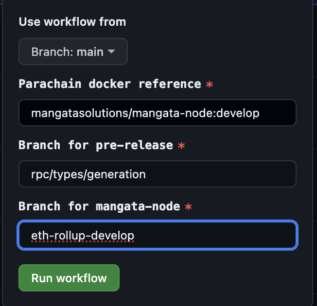

1. Create a new branch from **main** and name it **rpc/***, where the asterisk represents any desired identifier.
2. Initially, in the **packages/type-definitions** directory, include **rpc** and **types** (specifically for Polkadot apps).
3. Incorporate new RPCs and types under **mTypes** and **mRpc**.
4. After that you need to add those **rpc** and **types** into **packages/types**
5. Within the **interfaces/definitions.ts** file, append new types if any changes occur
6. For new RPCs like **xyk** or **pos**, insert their RPC into either **interfaces/xyk/definitions.ts** or **interfaces/pos/definitions.ts**.
7. If there is new rpc you need to create a new folder inside **interfaces** directory like for example **rolldown** directory and inside this directory you need to create **definitions.ts** file
8. Inside the **interfaces/rolldown/definitions.ts** file, ensure to export these RPCs as defaults (refer to the **xyk** or **pos** directory for guidance)
9. These steps encompass the process of adding new RPCs and Types.
10. Subsequently, proceed to push to the branch.
11. Once the changes are committed to the branch, manually initiate the release of all packages containing new RPCs and types.
12.  
13. **User workflow from** change from **main** to your branch in this case **rpc/types/generation**. Customize the elements depicted in the image as per your requirements.